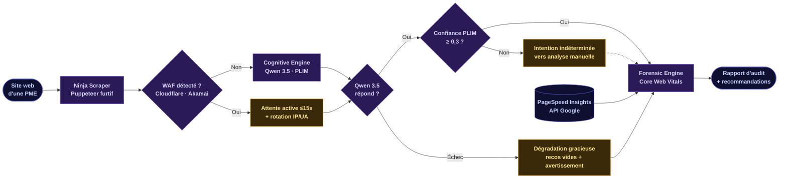

---
layout: cover
class: text-center
---

# L'Automatisation de l'Audit SEO par l'Intelligence Artificielle

Conception de la plateforme AuditIQ & évaluation de son impact sur la performance digitale des PME marocaines

  
Mohamad Aymen Charichi

  Sous la direction de M. Zakaria El Bakirdi

Université Mohammed V de Rabat — FSJES Souissi Master Marketing Digital et E-commerce · Année Universitaire 2025-2026

---
layout: default
---

# Plan de la soutenance

I

### Contexte & problématique

Le paradoxe digital des PME marocaines

II

### AuditIQ — l'architecture technique

Trois moteurs, une plateforme

III

### Étude empirique

42 PME, 13 semaines, des résultats mesurables

IV

### Limites & perspectives

Ce que ça ne prouve pas encore, et la suite

<!--
Un clic par partie : nommer chaque partie à voix haute avant qu'elle apparaisse à l'écran.
-->

---
layout: default
---

# L'évolution du SEO

Des mots-clés aux LLM : 15 ans de transformation

2011

### Panda

Qualité du contenu

2015

### RankBrain

Machine learning

2019

### BERT

Contexte bidirectionnel

2022

### HCU

Contenu utile

2024+

### LLMs

IA générative

<!--
Un clic par étape : nommer l'algorithme, l'année, et l'apport clé avant de cliquer.
-->

---
layout: fact
---

# Le paradoxe marocain

  
68 %

  
des PME marocaines n'ont pas de site web fonctionnel

109 % de pénétration Internet · 34 millions d'utilisateurs 4G… et pourtant, la transformation digitale ne suit pas au niveau des PME.

<!--
Présenter le chiffre d'abord (silence 2s), puis le paradoxe macro-vs-PME.
Source : Chapitre 2, notre analyse documentaire du tissu PME marocain.
-->

---
layout: quote
---

# Problématique

Question centrale · Chapitre 1

«

»

<blockquote style="margin: 0; padding: 0 1rem; font-size: 1.55rem; line-height: 1.6; color: var(--aiq-text); font-weight: 400; font-style: normal; border: none; letter-spacing: -0.005em; background: transparent; text-align: center;">

Dans quelle mesure l'automatisation de l'audit SEO par l'Intelligence Artificielle, couplée à une analyse sémantique avancée, peut-elle pallier les limites techniques et stratégiques des PME marocaines dans leur quête de visibilité en ligne ?

</blockquote>

Notre recherche · 2026

<!--
Citer la phrase au complet, sans coupure, à voix haute. C'est la question qui structure tout le mémoire.
-->

---
layout: default
---

# Trois sous-questions de recherche

Un parcours investigatif en trois dimensions

SQ1 · Technique

Comment les techniques d'extraction de données adaptées aux sites JavaScript-heavy peuvent-elles être optimisées pour permettre un audit SEO complet et précis malgré les contraintes de budget de crawl et de capacité de calcul des PME ?

SQ2 · Linguistique

Dans quelle mesure les modèles de langage naturel peuvent-ils être adaptés pour détecter et classifier l'intention de recherche des utilisateurs marocains, tenant compte du multilinguisme et des spécificités culturelles locales ?

SQ3 · Managérial

Quel est l'impact technique mesurable de l'implémentation des recommandations générées par un outil d'audit SEO basé sur l'IA sur les scores globaux d'optimisation et les Core Web Vitals des PME marocaines, dans le cadre d'une simulation de 13 semaines ?

<!--
Trois dimensions complémentaires : technique (extraction), linguistique (intention), managérial (ROI). Un clic par question, lire l'intitulé à voix haute.
-->

---
layout: default
---

# Hypothèses de recherche

Trois propositions vérifiables, une par dimension

H1

métrique d'évaluation

L'utilisation d'AuditIQ améliore significativement le score SEO global des PME après 12 semaines.

H2

efficacité opérationnelle

L'automatisation de l'audit technique se traduit par une amélioration significative des Core Web Vitals (LCP, FCP, CLS).

H3

pertinence contextuelle

L'ampleur des améliorations varie selon le secteur d'activité, avec un avantage particulier pour le secteur du e-commerce.

<!--
H1 = score SEO, H2 = Core Web Vitals, H3 = secteur. Chaque hypothèse est testée dans la PoC de 13 semaines.
-->

---
layout: default
---

# Méthodologie

Design Science Research & recherche-action

Approche

Design Science Research couplée à la recherche-action en ingénierie des systèmes d'information. Cycle itératif en 5 phases (diagnostic, planification, intervention, évaluation, apprentissage) selon Staron (2025).

PoC

Protocole quasi-expérimental simulé. 42 scénarios de PME, durée de 13 semaines, mesures T0/T3 (scores SEO, Core Web Vitals). Analyse statistique sous R : tests t appariés, ANOVA.

⚠ Note méthodologique

Simulation calibrée, pas de PME réelles.

Les 42 scénarios sont générés synthétiquement à partir des distributions de performance documentées dans la littérature, assurant un réalisme statistique ancré dans les données terrain du marché marocain.

<!--
L'approche et le PoC d'abord, puis la mention obligatoire en dernier — non négociable, à dire à voix haute.
-->

---
layout: section
---

Partie II

# AuditIQ

### L'architecture technique

Trois moteurs, une plateforme

---
layout: default
---

# Les 3 moteurs d'AuditIQ

**Extraction**

DOM rendu, même sur les sites React/Next.js

**Analyse sémantique**

Intention de recherche, densité informationnelle

**Diagnostic technique**

LCP, FCP, CLS — mesurés, pas estimés

<!--
Laisser le diagramme respirer avant de commenter. Un clic par carte, dans l'ordre du flux : "extraction" en pointant Ninja Scraper, "analyse" en pointant Cognitive Engine, "diagnostic" en pointant Forensic Engine.
-->

---
layout: default
---

# Ninja Scraper

Extraction furtive, même quand le site se dérobe

~ audit.run --ninja --stealth

[01]

&gt;
Puppeteer, pas un simple fetch HTTP

# Un scraper HTTP classique ne voit que le HTML brut envoyé par le serveur — vide ou quasi vide sur un site React/Next.js, où le contenu s'affiche seulement après exécution du JavaScript côté client.

[02]

&gt;
Rendu complet avant extraction

# Puppeteer pilote un vrai navigateur headless : il attend la fin du rendu côté client, puis extrait le DOM final — celui que voit réellement un visiteur humain, pas le squelette HTML de départ.

[03]

&gt;
Furtivité

# Mesures anti-détection pour éviter le blocage par les pare-feux applicatifs que beaucoup d'hébergeurs activent par défaut.

<!--
24% des PME de l'échantillon tournent sur React/Next.js (Table 4.2, présentée en Partie III) — exactement le cas où un scraper naïf échoue silencieusement. Rappel optionnel, pas obligatoire à ce stade.
-->

---
layout: default
---

# Cognitive Engine

Qwen 3.5-32B comme moteur de raisonnement sémantique

  MMLU 87,8
  119 langues
  T = 0,4
  10× moins cher que GPT-4

  

  

    

      <svg viewBox="0 0 24 24" fill="none" stroke="currentColor" stroke-width="1.8" stroke-linecap="round" stroke-linejoin="round">
        <path d="M4 5h16l-6 7.5V19l-4 2v-8.5L4 5z"/>
      </svg>
    

    
01

    
Pré-traitement

    
DOM nettoyé, bruit UI filtré

  

  

    

    

      <svg viewBox="0 0 24 24" fill="none" stroke="currentColor" stroke-width="1.8" stroke-linecap="round" stroke-linejoin="round">
        <path d="M4 5.5h16v10H10l-4 3.5v-3.5H4v-10z"/>
        <path d="M8 9.5h8M8 12.5h5"/>
      </svg>
    

    
02

    
Prompt

    
Système + données JSON contraint

  

  

    

    

      <svg viewBox="0 0 24 24" fill="none" stroke="currentColor" stroke-width="1.8" stroke-linecap="round" stroke-linejoin="round">
        <rect x="6" y="6" width="12" height="12" rx="1.5"/>
        <rect x="9.5" y="9.5" width="5" height="5" rx="0.5"/>
        <path d="M9 2.5V6M12 2.5V6M15 2.5V6M9 18V21.5M12 18V21.5M15 18V21.5M2.5 9H6M2.5 12H6M2.5 15H6M18 9H21.5M18 12H21.5M18 15H21.5"/>
      </svg>
    

    
03

    
Inférence

    
Qwen 3.5 via Ollama (timeout 120s)

  

  

    

    

      <svg viewBox="0 0 24 24" fill="none" stroke="currentColor" stroke-width="1.8" stroke-linecap="round" stroke-linejoin="round">
        <circle cx="12" cy="12" r="8.5"/>
        <path d="M8.2 12.3l2.6 2.6 5-5.6"/>
      </svg>
    

    
04

    
Post-traitement

    
Parsing JSON, validation, fallbacks

  

PLIM

Probabilistic Latent Intent Matrix

Vecteur d'intentions probabiliste multi-étiquettes — étend Broder (2002) en capturant la nature hybride des requêtes modernes. Lexiques multilingues : <strong>FR · AR · EN</strong>.

IGD

Information Gain Density

Score propriétaire (théorie de Shannon) mesurant la densité informationnelle du contenu face au <strong>top 10 SERP</strong> — récompense les "fringe entities" qui différencient la page.

<!--
PLIM : l'abstract dit "Pertinence, Longueur, Intention, Mots-clés", le chapitre 3.3.3 dit "Probabilistic Latent Intent Matrix" — cette 2e définition est utilisée ici (avec modèle réel). Anticiper la question si un membre du jury a lu l'abstract de près.

IGD : pas de formule IGD affichée à l'écran, par prudence — la formule (3.6) existe au chapitre 3.3.2, le slide se contente d'expliquer l'intuition. Le mot "fringe entities" vient directement du §3.3.2.

Inférence via Ollama : confirmé au §4.x (module aiRecommender.js) — l'API est locale, ce qui justifie le 10× moins cher et la contrainte GPU.

La matrice de classification d'intention (TOFU/MOFU/BOFU/Nav + lexiques FR/AR) est traitée sur le slide suivant pour laisser ce slide-ci respirer.
-->

---
layout: two-cols
---

# Forensic Engine

Ce qui est mesuré, pas estimé

LCP

Largest Contentful Paint — temps d'affichage du plus grand élément visible

FCP

First Contentful Paint — premier affichage de contenu textuel ou visuel

CLS

Cumulative Layout Shift — stabilité visuelle pendant le chargement

::right::

**Infrastructure — 5 microservices, Docker**

React 19 + Vite · Node.js + Express · Puppeteer · API Qwen 3.5 · MongoDB Atlas M0

  
0–10€

  
Hébergement par mois

Contre 50–100€/mois pour un outil SaaS équivalent — réduction de 80 à 90%

<!--
Le contraste "mesuré, pas estimé" mérite d'être dit à voix haute : beaucoup d'outils SEO grand public affichent des scores de performance sans jamais faire tourner Lighthouse — ici les 3 métriques sont calculées directement, pas approximées.
-->

---
layout: section
---

Partie III

# Étude empirique

### Validation d'AuditIQ auprès de 42 PME marocaines

42 PME, 13 semaines, des résultats mesurables

---
layout: default
---

# Protocole expérimental

  
18

  
E-commerce

  
12

  
Tourisme

  
12

  
Services B2B

  T0 — référence
  13 semaines
  T3 — mesure finale

**Note méthodologique**

N=42 scénarios de PME marocaines générés par simulation computationnelle calibrée sur des distributions documentées dans la littérature — pas d'entreprises réelles. Ce choix, assumé et justifié en Partie I, limite la portée des résultats à une validation de cohérence interne d'AuditIQ.

---
layout: fact
---

# 47,3/100

Score SEO moyen à T0

LCP moyen : 6,2s — plus de deux fois le seuil Google (2,5s)

---
layout: statement
---

# AuditIQ améliore significativement la performance SEO mesurée

  

    
47,3 → 68,9

    
Score SEO / 100

  

+21,6 points · p < 0,001 · d = 1,68 (effet très large) · N = 42, T0 → T3

---
layout: default
class: aiq-cwv
---

# Core Web Vitals — T0 → T3

| Métrique | T0 | T3 | Δ | Signification |
|---|---|---|---|---|
| **LCP** | 6,2s | 3,1s | −3,1s | p < 0,001 |
| **FCP** | 3,8s | 2,1s | −1,7s | p < 0,001 |
| **CLS** | 0,21 | 0,09 | −0,12 | p < 0,001 |

LCP ≤ 2,5s

17% des sites à T0 → 67% à T3

CLS ≤ 0,1

74% des sites atteignent le seuil à T3

---
layout: two-cols
---

# Analyse sectorielle

E-commerce
+24,3

Tourisme
+19,8

Services B2B
+18,1

::right::

  
p = 0,024

  
ANOVA · F = 4,12 · effet sectoriel

Là où l'écart se confirme

  ✓ E-com. vs B2B
  p = 0,018

  ✗ Tourisme vs B2B
  p = 0,34

L'avantage e-commerce est réel, mais il ne se généralise pas : AuditIQ aide tous les secteurs, l'e-commerce en bénéficie davantage.

---
layout: default
---

# Validation des hypothèses

H1 — validée

AuditIQ améliore significativement le score SEO (p < 0,001)

H2 — validée

L'automatisation améliore significativement les Core Web Vitals (p < 0,001)

H3 — partiellement validée

L'e-commerce bénéficie davantage, mais les autres secteurs progressent aussi significativement

---
layout: default
---

# Recommandations pour dirigeants de PME

**IA comme levier, pas substitut**

Validation humaine systématique — le modèle hybride obtient les meilleurs résultats

**Prioriser les "quick wins"**

HTTPS, 404, balises manquantes = 45% du gain total entre T0 et T1

**Monitoring continu**

Rituel hebdomadaire + revue stratégique mensuelle

**Anticiper la montée en compétence**

8 à 12h de formation initiale recommandées

| Phase | Semaines | Action |
|---|---|---|
| Diagnostic | 1–2 | Audit initial, priorisation |
| Corrections rapides | 3–4 | HTTPS, 404, balises |
| Optimisation | 5–8 | Contenu, structure |
| Consolidation | 9–12 | Suivi, ajustements |

<!--
Approche structurée (ce séquencement) : +23,4 points, contre +16,8 points pour une approche non structurée. Chiffre pour l'oral si le temps le permet, pas nécessaire à l'écran.
-->

---
layout: two-cols
---

# Limites

Ce que la simulation ne capture pas — et ce qui reste à prouver

**Échantillon & biais de sélection**

N=42 limite la puissance statistique sur les sous-groupes (80% effet moyen, 45% petit effet) ; échantillon de convenance, non représentatif des TPE et secteurs traditionnels.

**Durée limitée**

13 semaines ne suffisent pas à observer l'impact réel sur le trafic organique — les effets SEO se déploient généralement sur 3 à 6 mois.

**Pas de groupe de contrôle**

Impossible d'isoler l'effet propre d'AuditIQ des facteurs concurrents (mises à jour Google, saisonnalité, actions marketing parallèles).

::right::

**Données de laboratoire, pas de terrain**

Scores PageSpeed (labo) vs données réelles (RUM/CrUX) — le labo surestime généralement de 15 à 20% ; aucune donnée business réelle (trafic, conversion, ROI) collectée.

**Hallucinations de l'IA**

2,5% des recommandations (3 sur 120) — détectées et écartées par validation humaine, pas par le système lui-même.

**⚠ La limite fondamentale**

L'ensemble des résultats provient d'une <strong style="color: var(--aiq-text);">simulation calibrée, pas de PME réelles</strong>. Cela valide la cohérence interne d'AuditIQ — ce n'est pas encore une preuve d'impact en conditions réelles. Une étude longitudinale avec de vraies PME reste nécessaire.

<!--
La carte "La limite fondamentale" a été déplacée d'un callout séparé (aiq-gradient-border) à une carte de la 2e colonne pour équilibrer la mise en page 3+3. Le contenu textuel est identique à la version précédente.

Distribution des cartes :
- Colonne gauche : Échantillon · Durée · Contrôle (les trois limites méthodologiques classiques d'une étude quasi-expérimentale)
- Colonne droite : Labo · Hallucinations · Limite fondamentale (les deux limites techniques + le disclaimer principal)

Le chip ⚠ et la bordure amber signalent que la 6e carte est le disclaimer central de la thèse — elle ne doit pas être lue comme une limite parmi d'autres mais comme la mise en garde globale.
-->

---
layout: default
---

# Perspectives — vers une V2

Données réelles

Intégration GA4 — combler l'écart entre scores de laboratoire et impact business réel

Positionnement

Tracking concurrentiel — situer chaque PME face à ses concurrents directs, pas seulement dans l'absolu

Linguistique

Extension à la Darija — au-delà du français et de l'arabe standard, pour coller aux requêtes réellement tapées par les Marocains

Infrastructure

Passage à une architecture SaaS cloud — lever la contrainte du serveur GPU dédié pour Qwen 3.5

---
layout: statement
---

# L'automatisation de l'audit SEO par l'IA est techniquement viable pour les PME marocaines

AuditIQ démontre, à l'échelle d'une preuve de concept, qu'une architecture accessible (0–10€/mois) peut produire des gains mesurables et statistiquement significatifs — la prochaine étape est de le prouver sur le terrain, pas seulement en simulation.

---
layout: end
---

# Merci

Questions & discussion

Mohamad Aymen Charichi · AuditIQ Sous la direction de M. Zakaria El Bakirdi

